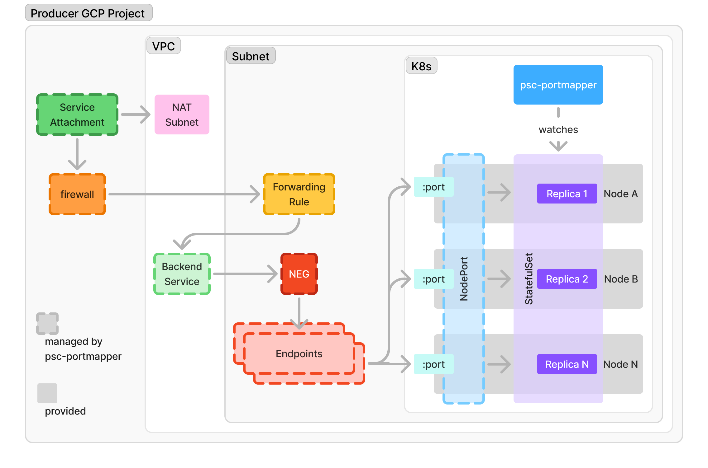

# Design

## Background

Up until 2024, GCP's forwarding rules were all load balancers with no routing capabilities. This is fine for stateless processes, where any process of a group can handle a request just as well as any other.

Nevertheless, for processes that rely on stateful protocols (e.g. Kafka), where only some processes in the group can fulfill a specific request, this behavior is incompatible with the way they expect connections to be established.

### Motivation

[Private Service Connect](https://cloud.google.com/vpc/docs/private-service-connect) (PSC) allows services in project A/ VPC X (the _producer_ side), to be accessible from project B/ VPC Y (the _consumer_ side) via "service attachments" (an abstraction over NAT).

To expose a cluster of stateful processes through PSC, providers like [Confluent](https://docs.confluent.io/cloud/current/networking/private-links/gcp-private-service-connect.html) & [Instacluster](https://www.instaclustr.com/support/documentation/kafka/using-kafka/connecting-to-a-private-service-connect-apache-kafka-cluster/) expose one service attachment per broker. As a user, this is a PITA - you have to perform N sets of manual steps for a cluster with N brokers - establishing the PSC endpoint/ service attachment connection, setting up DNS, creating N different subnets with [purpose: `PRIVATE_SERVICE_CONNECT`](https://codelabs.developers.google.com/cloudnet-psc-ilb#10). If you scale your cluster up (something that managed Kafka providers support, usually transparently), you have to perform the list of steps yet again, or the new broker/ node won't be reachable from the consumer side.

## Proposal

[Port-mapping Network Endpoint Groups](https://cloud.google.com/load-balancing/docs/negs#port-mapping-neg) (NEGs) were introduced earlier in 2024, adding routing capabilities (at layer 4, via ports) to their load-balancing offering.

By leveraging port-mapping NEGs, the per-replica service attachment model can be ditched to use a single service attachment exposing each replica on a different node.



### Spec

```yml
apiVersion: apps/v1
kind: StatefulSet
metadata:
  name: web
  annotations:
    0x5d.org/psc-portmapper: '{"prefix":"prefix-","nat_subnet_fqns":["projects/my-project/regions/us-east1/subnetworks/my-subnet"],"node_ports":{"app":{"node_port":30000,"container_port":8080,"starting_port":30000}}}'
spec:
  selector:
    matchLabels:
      app: db
  serviceName: "db"
  replicas: 3
  minReadySeconds: 10
  template:
    metadata:
      labels:
        app: db
    spec:
      terminationGracePeriodSeconds: 10
      containers:
      - name: db
        image: db:latest
```
- https://codelabs.developers.google.com/cloudnet-psc-portmapping
- https://cloud.google.com/vpc/docs/about-private-service-connect-port-mapping
- https://cloud.google.com/load-balancing/docs/negs#port-mapping-neg